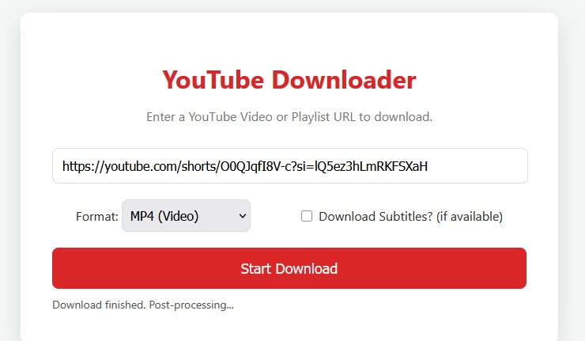

# youtubedownloader
Download youtube videos as mp4 or mp3 with or without subtitles

🎬 Web-Based YouTube Downloader

This project provides a user-friendly, local web interface for a powerful Python-based YouTube downloader. Built with Flask, it transforms a command-line tool into an accessible web application that runs directly on your PC, giving you a simple UI to download videos, playlists, and channels with advanced options.

✨ Key Features

    🌐 Simple Web Interface: No need for command-line arguments. Just use your web browser.

    🎬 Multi-Content Support: Download single videos, entire playlists, and full channels.

    🎧 Format Selection: Choose between downloading MP4 (video) or high-quality MP3 (audio only).

    ✍️ Subtitle Downloads: Optional support for downloading subtitles for videos if they are available.

    📊 Real-Time Progress Bar: See the live status of your downloads, including percentage, speed, and ETA.

    ⚙️ Self-Contained FFmpeg Path: Configure the path to FFmpeg directly in the code, avoiding the need to modify system environment variables.

📋 Requirements

Before you begin, ensure you have the following installed on your system:

    Python 3.7+: This project is built on Python. You can download it from the official Python website.

    FFmpeg: This is a crucial tool required for merging video and audio files and for converting videos to MP3.

        Download FFmpeg from the official website (Windows builds).

        Extract the downloaded .zip file to a permanent location on your computer (e.g., C:\ffmpeg). You will need the path to its bin folder.

    A Modern Web Browser: (e.g., Chrome, Firefox, Edge).

🛠️ Installation & Setup

Follow these steps to get the application running on your local machine.

1. Clone the Repository
Open your terminal or command prompt and clone the project to your computer.
code Bash
IGNORE_WHEN_COPYING_START
IGNORE_WHEN_COPYING_END

    
# If you have git installed
git clone <your-repository-url>
cd youtube_downloader_web

  

Alternatively, just download the project files as a ZIP and extract them.

2. Install Python Dependencies
Navigate into the project directory and install the required Python packages using the requirements.txt file.
code Bash
IGNORE_WHEN_COPYING_START
IGNORE_WHEN_COPYING_END

    
# It's recommended to use a virtual environment
# python -m venv venv
# venv\Scripts\activate  (on Windows)

pip install -r requirements.txt

  

3. Configure the FFmpeg Path (Important!)
This step is required to ensure the application can find FFmpeg.

    Open the file download_logic.py in a text editor.

    Find the line FFMPEG_PATH = r'...'.

    Replace the placeholder path with the full path to the bin folder inside your extracted FFmpeg directory.

Example for Windows:
If you extracted FFmpeg to C:\ffmpeg, the path would be:
code Python
IGNORE_WHEN_COPYING_START
IGNORE_WHEN_COPYING_END

    
# In download_logic.py
FFMPEG_PATH = r'C:\ffmpeg\bin'

  

    Note: Using r'' (a raw string) is important as it correctly handles the backslashes in Windows paths.

▶️ How to Use

Once you have completed the installation and configuration, running the application is simple.

    Start the Web Server
    Open your terminal or command prompt, navigate to the project's root directory, and run the following command:
    code Bash

IGNORE_WHEN_COPYING_START
IGNORE_WHEN_COPYING_END

    
python app.py

  

See the Server Running
You should see output in your terminal indicating that the server is running, along with the local URL.
code Code

    IGNORE_WHEN_COPYING_START
    IGNORE_WHEN_COPYING_END

        
    --- YouTube Downloader Web UI ---
    Downloads will be saved to: C:\path\to\your\project\downloads
    Open your web browser and go to: http://127.0.0.1:5000
     * Running on http://127.0.0.1:5000

      

    Open the Web Interface
    Open your web browser and navigate to the address:
    http://127.0.0.1:5000

    Download Content

        Paste a YouTube video, playlist, or channel URL into the input box.

        Select your desired format (MP4 or MP3).

        Check the "Download Subtitles?" box if needed.

        Click the "Start Download" button.

The progress bar will appear, and you can monitor the status directly on the page. All downloaded files will be saved into the downloads folder within the project directory.
🙏 Acknowledgements

This project enhances and builds a web interface upon the excellent command-line tool Download Simply Videos From YouTube. The original project provides the core yt-dlp logic for downloading content efficiently.

    Original Project URL: https://github.com/pH-7/Download-Simply-Videos-From-YouTube
